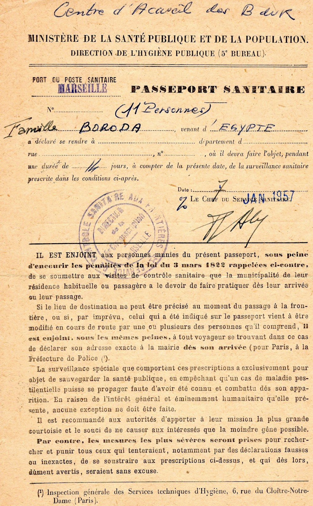

In my previous segment, I described the incredible disruptions we encountered in our daily life and the government interference which led to our final demise. It was a noticeably short period which hardly highlights the rich legacy we were leaving behind at that time. 

As I started to search into our past, it became evident that we were not just moving from a country. We were leaving our roots and our page in history. It was hard for me to imagine how difficult it must have been leaving our family members who had passed.  

When we left Egypt, we knew that our passports were labeled one way with no return. It would take many years before anyone could return to Alexandria to visit. Fortunately, our cousins Tino and Michele made a nostalgic visit in April 1995, some 40 years after our departure. They saw where we grew up and witnessed firsthand how life was so different from when we lived there.  

They looked for the neighborhoods where we all lived and found with much ease the apartment building where Tino grew up. Unfortunately, they had difficulty locating where we lived on the corniche (seashore) 

They visited the schools Tino and Andre attended starting with St Catherine and eventually got to connect with teachers at college St Marc. Remarkably, the registers containing both Tino and Andre's grades with great merit were still intact. The professors were ecstatic over hearing French as most of the language now spoken in Egypt is Arabic.  

Tino and Michele partook in authentic meals and visited many sites that (Tino) remembered as a Teenager. At the highlight of their journey, they were able to visit the main synagogue in Alexandria, Eliahu Hanabi. The main gate was heavily guarded. They discovered, not surprisingly, that only a few congregant members (less than 5) remain.  

Some of the pictures taken inside the synagogue featured the individual pews, well maintained and marked with people's family names engraved from the Jewish community which once thrived. The torah scrolls looked well preserved as was the inside of the synagogue which is protected as a historical site. 

Services were once widely attended in this beautiful synagogue. In its hay days many happy occasions were held and so many were married within its walls. Grandpa Soly and Grandma Rachel were married in 1942 as were Aunts, Uncles and so many others. 

While visiting the synagogue, cousin Tino wanted to find out about the Jewish Cemetery where his father Marco Hazan, our uncle, Grandfather Abramino Boroda and other family members were interred. Fortunately, a member of the Jewish community was able to provide some details from registers which were preserved. This was for the main Jewish cemetery in Alexandria. Upon entering through the main gate, they described the condition of the cemetery grounds. It was disheartening to find that it had been grossly neglected with overgrown grass and weeds. Unfortunately, the groundskeeper could not read nor speak, and therefore he was unable to provide much information on locating the graves. Tino and Michele searched all through the grounds hoping to find family graves. Despite extraneous efforts and perseverance, they were never able to find them. It was with great disappointment and very heavy hearts that they finally left the cemetery. 

This precious page in history will always remain in our memory. We pray for the dignity of all our family members who are interred in Alexandria and those we left behind that they should never be forgotten. 

__1915__:
Abramino Boroda (Nona Rosa's husband, Grandpa Soly, Uncle David Boroda and Aunt Laura Hazan's father)

__1943__:
Emile Hazan at age 6 days (Uncle Marco and Aunt Laura Hazan's son, cousins Tino, Andre and Adrienne's brother)

__1945__:
Elie Boroda (Nona Rosa's son, Grandpa Soly, Uncle David Boroda and Aunt Laura Hazan's younger brother)

__1951__:
Vivianne Hazan (Uncle Marco and Aunt Laura Hazan's daughter, cousins Tino, Andre and Adrienne's sister) at 2 years of age, and 1 month before her father Marco Hazan passed

__1951__:
Uncle Marco Hazan, (Aunt Laura's husband, Tino, Andre and Adrienne's father)

__1957__:
Sylvie Hazan (Uncle Marco Hazan's sister, cousins Tino, Andre and Adrienne's Aunt) _She passed after we left Egypt._

__Unknown date__:
Celine Sades (Grandma Rachel, Uncles David and Isaac Sades, and Aunt Mary Anaf's younger sister)

## We were now forced to forge forward...

As I reflect on all that was involved in preparing for our departure, we had to leave under very intense pressure and strict government control. Each family had their own situation in terms of citizenship they possessed and which country they would go. Communication was restricted due to government censure; it was difficult to keep in touch or to know where our friends and families were slated to go, when they were leaving or which boat they were taking.  

The formalities for applying to enter a foreign country were quite complex as many of the countries including the U.S had strict immigration quotas. We were able to obtain French passports by the Consulat De Suisse en Alexandrie (Swiss Consulate in Alexandria). Both Grandpa Soly and Grandma Rachel's passports were issued on 28 March 1955 with an expiration date of 27 March 1958. [I scanned copies that I am including.] I explained why Grandpa Soly's nationality was Tunisian (born in Egypt). As Tunisia was under a French protectaria (protectorate) it was easier to secure a French passport. We were not Egyptian citizens, and as stated earlier we were known as Apatride (Stateless) French protected 

The main agency that helped facilitate our departure from Egypt and ensure our safety was the International Red Cross. There were other agencies that assisted Egyptian Jewish refugees arriving in France who were escaping instability and persecution; FSJU, Fonds Social Juif Unifie, similar to the USA United Jewish Appeal, le COJASOR (Comité Juif d'Action Sociale et de Reconstruction), Jewish Social Action Committee and Reconstruction which also provided help to Jewish refugees, among others.  

At the time we arrived in France in early 57 there was already an influx of Jewish families fleeing unstable governments who immigrated to France. They came from other Arab countries, Algeria, Tunisia and Morocco. As refugees, we were all in the same predicament.  

## Our voyage was about to begin

We arrived at the port in Alexandria and entered what appeared to be a large building with several partitions. There were many families each awaiting to be called to be interviewed or interrogated by officers whose goal was to retrieve and confiscate valuables, especially jewelry and currency.  

It seemed the process went on for hours with each family taking their turn. I could hear screaming and crying. I could not completely ascertain what was happening because much of the interrogation was behind partitions. I later heard that any object of value became fair play at the hands of the officers. The process continued with final checkpoint for the formalities which was providing our French passports; Grandpa Soly's passport included Albert, Sam, me and Robert, Grandma Boroda and Nona Rosa Chouchana had their own, and Aunt Laura's passport included Tino, Andre and Adrienne. The phase of checking and stamping passports was quite intense and lengthy. As kids, I remember we were getting quite impatient as it was difficult to keep us entertained within the confinement of this hangar. 

The process of checkpoints continued all the way until we reached the ship. We were slowly reaching our final passage which would finally lead us away from Egyptian control. After stamping our passports, we knew we would be passing onto the path leading to the ship where a new adventure was awaiting. 

### 26 December 1956

  
_l'Enotria at sea_

  
_l'Enotria tied to a dock_

We boarded our ship called l'Enotria which seemed quite large, but nothing compared to todays' mega ships. It was dark and the air was cool. All we could see was the reflection of the lights on the water with calm ripples. The boat was tied to the dock all lit up. Our ship destination was Marseille France which was our port of entry as was for many Egyptian refugees. From this port, families transitioned to other destinations. Uncle David (Doudou), Aunt Esther and our cousin Eli (Lilli) Boroda boarded aboard another ship called l'Esperia.  Their destination was Panama. This is where Aunt Esther's family was living at the time.  

Once on board, we felt free to roam. We found our cabins trying to figure out where everyone was going to sleep, and slowly connected with others. This was the first time we could determine who was on our ship. We quickly found out that my cousins Allegrina, Benny and Rebbie (Rebecca), Uncle Isaac and Aunt Marie Anaf were on the same boat which was quite a surprise as we were unaware until this point. Communication was very limited as I already eluded. Everyone was dispersed at the time of our departure depending on where they were going. Each had their story. Reconnecting with friends and family would become monumental. Later, when we arrived in France, we heard from families and friends either by letter or by telegram. 

I connected with childhood friends, Arlette and Andre Lusena who were also on our boat. They were going to Marseille and then Italy, their father's country of origin. It was exciting to see friends close in age, and we got into our usual mischievous and exploring behaviors, going up and down stairs and running from one deck to the next. For us kids, it was a new and exciting time, but we could sense the feelings our parents were experiencing which was far from leisurely. It became evident that the only good thing being on this boat was leaving persecution behind. 

As we were getting accustomed to this unfamiliar environment, older siblings by nature took care of the younger ones, such that Cousin Adrienne helped take care of younger brother Robert who at the time was a year and a half. Cousin Rebbie (Rebecca) Anaf was about the same age as Robert and Allegrina looked over her younger sister.  

Reality was setting in knowing that in a short time, we would be sailing away from our native country.  I am sure our parents were feeling overwhelmed with mixed emotions following all the formalities they endured. One silver lining was that we were at least going to a country which spoke our native language, and we were already accustomed to a French style of living. The unknown, however, must have been very stressful as I later found out that settling into new communities, finding a job, a place to live, and making friends, etc...  would be very difficult. Our parents had to remain strong, and we often heard them utter either in Arabic or in French “G-d will be there to watch over us”. We were 11 as part of our immediate family unit; Grandpa and Grandma Boroda, Albert, Sam, me and Robert, Nona Rosa, Aunt Laura, Tino, Andre and Adrienne.  

With the boat docked and in calm waters, everything seemed fine. Knowing that our voyage across the Mediterranean was going to be taking several days, I could sense apprehension as some verbalized fearing motion sickness. Personally, I had only been on a few short trips on a sailing vessel in Alexandria, and never experienced it.  

As hours went by, people were settling into their cabins. I remember going from one area to the next with my childhood friends and cousins. We couldn't think of anything except to have fun. I remember being told we were going to France, but I did not have an appreciation on how far or how long it would take. I later found out that the trip across from Alexandria to Marseille would be almost 2 weeks. With no real appreciation for time, it didn't dawn on me that this was quite a long journey, nor did I realize being confined on a ship for that long. 

The moment finally arrived when we would leave. The beautiful Mediterranean Sea shore on the banks of Alexandria we so enjoyed would be a distant memory. We heard loud horns resonating in the quiet air. The sound was frightening, as this continued several times. The ship decks were crowded with people watching as the large ropes were being detached from the dock. On the dock stood a few onlookers who seemed sad to see us leave. There was a lot of crying, and tears being shed as they were waving. The same was true of the passengers on the ship. 

We were slowly moving away from the dock as everyone continued to wave to each other as long as they could. The ship made its way quietly out of the harbor. Everything was getting smaller as we were some distance from the shore. A couple of final loud horns sounded. We were on our way. 

It was our first night away from home in a strange environment. In our cabin, there was a small round window which looked onto the water. I remember going to sleep but it did not seem long. As I awoke, I watched the scenery as eventually daylight was starting to show. Everyone would slowly get ready as they gathered for breakfast. My first inkling was to go up on deck to watch as the boat was swishing through the waves. It looked like fun. We could see from a distance some of the shores as the boat was moving what seemed quite fast.  

It was a few days when the ship crossed over into the open seas and far away from the coast. The waters started to become ruff. I cannot recall which day it was, but it seemed we encountered very strong waves, as the ship eventually entered very stormy weather. People got quite ill. It was a very unpleasant situation making it very difficult to look after each other. I cannot remember how or who handled Robert or our cousin Rebbie as they were only toddlers. Somehow, they were taken care of and managed to be kept safe. 

The storm seemed to gain intensity. At one point, I was curious to see what was happening on one of the decks. It was a very dangerous situation. Getting on deck was absolutely forbidden and access was under lock and key. From a distance, I could see the lounge chairs which had not been secured sliding from one end of the deck to the other as the boat swayed back and forth as well as up and down. It felt like a roller coaster with tall waves crashing onto the ship. Everyone felt helpless. We could hear pleas for help uttered in several languages with sadly no relief. I don't think anyone was spared from being affected, even the crew including the ship doctor. After all, it was winter with unpredictable weather. This monster storm was the culminating event of the whole journey and one we could not forget. We were all bracing for this ordeal to come to an end. It seemed like an eternity but eventually, it settled down, the days got brighter, and the seas became calmer. 

As each day arose, life on ship seemed to improve. It was much more pleasant to appreciate the scenery especially when we approached Italy. I could hear descriptions of our location but did not have an appreciation where we were in relation to our end point. I just simply went about life again catching up with friends and cousins. It was great to finally be able to roam around without fear. Today, I have an appreciation when I look at the map to retrace our voyage, and now realize that when we reached the coast of Italy, it would be the final stretch until we arrived in France. 

### 7 January 1957

<!--  \
_Certificate of Public Health upon entry in France, Marseille – Department Bouches du Rhone]_ -->

After a 13-day long journey, the boat slowly made its way towards Marseille. As we approached, we could appreciate the beautiful and picturesque views of this large and dense cosmopolitan city. At the top overlooking the city stands la basilique de Notre Dame de La Garde, (Notre Dame Basilica) the main cathedral. 

The ship entered the port of Marseille, a major port in Southern France, quite large. No surprise it took a while to navigate through the maze of the port paths until we finally docked. There was intense coordination to ensure families were gathered and organized for an orderly exit. It was far from free for all, and we had to intently be alert to instructions being given and follow our guide. I don't quite remember the specifics, but I can see why it would need to be hyper focused.  

Marseille was a port of entry for everyone arriving from Egypt. After disembarking, we needed to go through customs and all our papers (passports) had to be checked to be allowed into the country. This process was far less intrusive than the precedent. At least we knew we were in friendly territory under the auspices of the French government and coordination of the agencies that would process where everyone would go.  

Marseille was a point of access from which families could choose where they could go providing a quota had not been reached. There seemed to be a lot of confusion and I think the government was trying to keep families together as much as possible. Forgive my ignorance as I am sure the process was more involved than what I describe. 

There were temporary areas (housing) where families would need to go until they finally settled into a community. Marseille for us was a shortstop as we did not choose to stay there, at least initially.  

There were several families and ours was one of them that eventually settled in Bordeaux, France. 

Why Bordeaux? I found out that during discussions with authorities, Tino is the one who chose that city, where both he and his brother Andre would attend medical school. Bordeaux was more conducive to these studies.

These are just a few paragraphs of our story. It seems so much has happened from the time we left Egypt until we reached France, starting a new life. 

In my next segment, I will continue with our journey from Marseille, through our different stays in France until we arrived in Bordeaux. 

Thank you for your interest.
